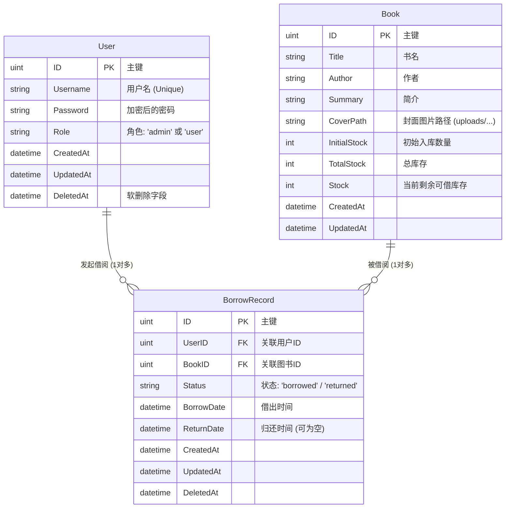
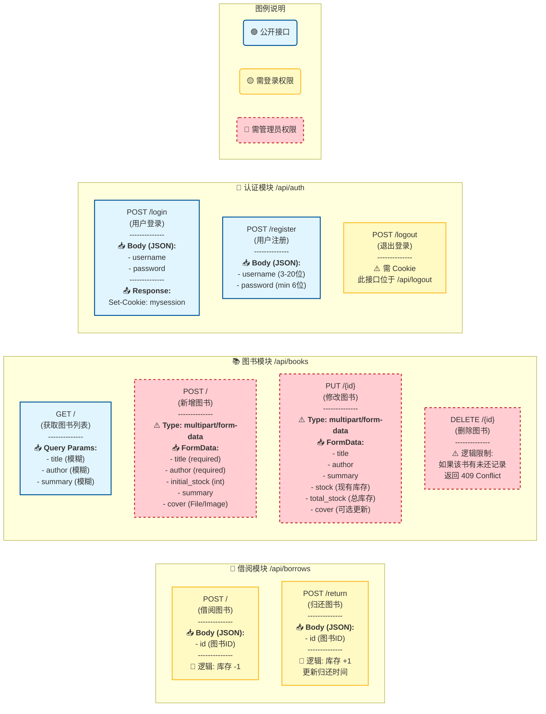

# 图书馆管理系统
## 规划
后面考虑打包成docker镜像。


## `.env`放进`.gitignore`了
## 数据库使用
使用`Redis`存储`session`
使用`MySQL`存储用户和借书信息

## Kafka 在项目中的功能
项目使用 Kafka 做借阅领域事件流转，当前客户端为 `franz-go`。

- 事件来源：借书成功、还书成功后，`BorrowService` 会发布事件。
- 事件类型：`borrowed`（借出）、`returned`（归还）。
- Topic：`borrowed-events`、`returned-events`（可通过环境变量覆盖）。
- 消费组：`library-borrow-consumer`（可通过环境变量覆盖）。
- 消费语义：手动提交 offset，消息处理后提交；反序列化失败也提交，避免毒消息阻塞分区。
- 作用：为后续扩展审计、通知、统计、推荐等异步能力提供事件入口。

默认环境变量（见 `backend/config/kafka.go`）：

- `KAFKA_BROKERS`，默认 `localhost:9092`
- `KAFKA_GROUP_ID`，默认 `library-borrow-consumer`
- `KAFKA_TOPIC_BORROWED`，默认 `borrowed-events`
- `KAFKA_TOPIC_RETURNED`，默认 `returned-events`
- `KAFKA_VERSION`：迁移到 `franz-go` 后保留兼容字段，不再用于强制协议版本

## franz-go 用法介绍（本项目）
### 1. 初始化 Producer / Consumer
在应用启动时初始化 Kafka 客户端：

```go
kafkaConfig := config.LoadKafkaConfig()
kafkaClientConfig, err := kafkainfra.NewConfig(kafkaConfig.Version)
if err != nil {
    logger.Fatalf("Kafka 配置错误: %v", err)
}

producer, err := kafkainfra.InitProducer(kafkaConfig.Brokers, kafkaClientConfig)
if err != nil {
    logger.Fatalf("Kafka Producer 初始化失败: %v", err)
}

topics := []string{kafkaConfig.BorrowedTopic, kafkaConfig.ReturnedTopic}
consumerClient, err := kafkainfra.InitConsumerGroup(
    kafkaConfig.Brokers,
    kafkaConfig.GroupID,
    topics,
    kafkaClientConfig,
)
if err != nil {
    logger.Fatalf("Kafka Consumer 初始化失败: %v", err)
}
```

### 2. 生产消息（同步发送）
服务层通过 `ports.Producer` 抽象发消息，底层由 `franz-go` 实现：

```go
msg := &kgo.Record{
    Topic: topic,
    Key:   []byte(key),
    Value: payload,
}
err := client.ProduceSync(context.Background(), msg).FirstErr()
```

### 3. 消费消息与提交位点
项目使用 `PollFetches` 拉取消息，逐条处理后手动提交：

```go
fetches := consumerClient.PollFetches(ctx)
fetches.EachRecord(func(record *kgo.Record) {
    _ = handler.HandleMessage(record.Topic, record.Partition, record.Offset, record.Value)
    _ = consumerClient.CommitRecords(ctx, record)
})
```

### 4. 关闭客户端
服务退出时调用统一关闭方法释放 Producer / Consumer 连接：

```go
if err := kafkainfra.Close(); err != nil {
    logger.Infof("Kafka 关闭失败: %v", err)
}
```

## 数据库架构图 (Database ER Diagram)

## API 接口功能全景图 (API Functional Map)
> 鉴权组件为`session`

